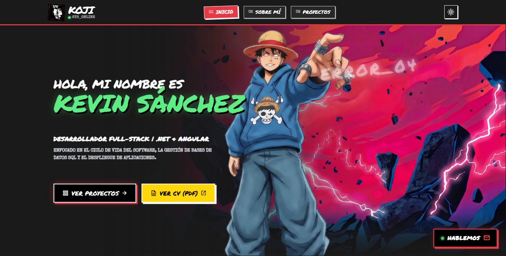

# Koji | Portfolio

  
  
  
  
  
  
  
  

This is my personal portfolio, built with **Angular**. I developed this project to explore creative **UI/UX** while maintaining a functional and scalable architecture. The "Sketch-Punk" aesthetic is powered by a **Firebase Firestore** integration that acts as a dynamic CMS, allowing me to manage my projects and tech stack in real-time without redeployments.

  

---

### Key Features

* **Custom "Sketch-Punk" UI**: A unique visual identity based on a hand-drawn aesthetic using **CSS/SCSS** with custom properties.
* **Light/Dark Mode**: Persistent theme toggling across the entire application.
* **Firebase Firestore CMS**: Dynamic data synchronization for projects and tech badges in real-time.
* **Serverless Contact Form**: Integrated with **EmailJS** for direct communication without a custom backend.
* **Responsive Design**: A fluid layout that adapts perfectly from desktop monitors to mobile devices.

---

### CI/CD & Deployment

This project follows modern DevOps practices to ensure automated and reliable delivery:

* **Automated Workflow**: I use **GitHub Actions** to trigger automated builds and deployments on every push to the `main` branch.
* **Containerization**: Managed through **Docker** to ensure environment consistency and easy scaling.
* **Remote Access**: Exposed to the internet using secure connections via **Cloudflare Tunnels**, allowing me to share the portfolio with potential employers and collaborators without compromising security.

---

### Contact

Feel free to reach out via the contact form on the site. Messages are delivered through EmailJS and include a timestamp for better context and traceability.